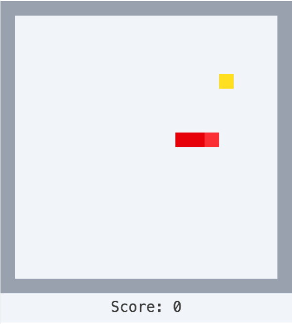

# ReScript Snake game



This is the code made during [Building a game with ReScript & KAPLAY](https://youtu.be/zUyrHXB_ImE).

## Running locally

```shell
# Install all dependencies
bun install

# Run the ReScript compiler
bunx rescript -w

# (In another shell)
# Run a dev server
bunx vite
```
## KAPLAY bindings

The ReScript bindings for KAPLAY are now available on npm as [@nojaf/rescript-kaplay](https://www.npmjs.com/package/@nojaf/rescript-kaplay).  
More info can be found on [https://nojaf.com/rescript-kaplay/](https://nojaf.com/rescript-kaplay/)